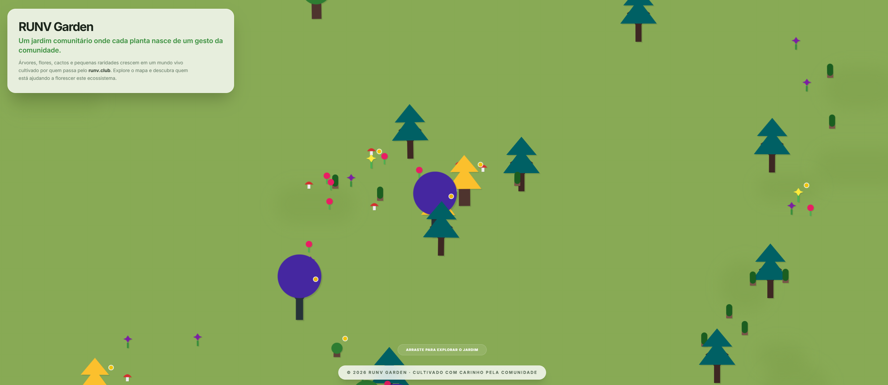

# RUNV Garden

## O quê

Jardim comunitário em vista isométrica, estilo pixel art. Cada planta no mapa representa contributos da comunidade em torno do runv.club. Arrasta o fundo para explorar o mundo.

## Requisitos

- Node.js (versão recente LTS serve)
- npm

## Correr em local

1. `npm install`
2. Copia `.env.example` para `.env.local` (ou `.env`) na raiz do projeto.
3. Define `GEMINI_API_KEY` com a tua chave da API Gemini. O Vite lê as variáveis através de `vite.config.ts` (`loadEnv` na raiz do repo).
4. `npm run dev` — o servidor sobe na porta 3000, acessível em `0.0.0.0` (útil em rede local ou contentores).

## Build

- `npm run build` — gera saída em `dist/`
- `npm run preview` — pré-visualiza o build de produção

## Nota

Não subas para o repositório ficheiros `.env` com chaves reais. Mantém só `.env.example` como modelo.
